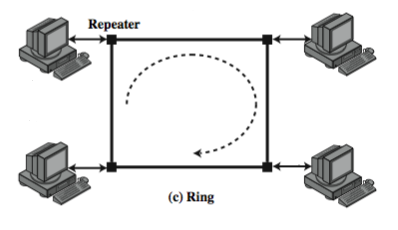
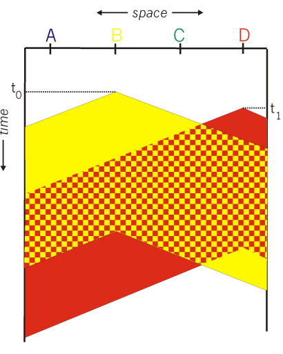

# Local Area Networks

## Netork Types

> - Classified depending on,
>   - Geographical area they cover
>   - Ownership
>   - Technologies used

- **PAN (Personal Area Network)**

  - Covers a very small area
  - Used for connecting devices/peripherals of individuals
  - Bluetooth, etc.

- **LAN (Local Area Network)**

  - Covers a small area
  - Used for connecting devices in a building or a campus
  - Ethernet, Wi-Fi

- **MAN (Metropolitan Area Network)**

  - Covers a city or a large campus
  - Used for connecting buildings in a city
  - Fiber optics, etc.

- **WAN (Wide Area Network)**

  - Covers a large geographical area
  - Used for connecting cities or countries
  - Internet

- **Interplanetary Internet**
  - Used for connecting devices in space
  - Used for communication between planets

## Network Topologies

- The way in which devices are connected in a network is called a network topology.

### Bus Topology

- **Bus**: A single communication line shared by all devices.
- **Tap**: An interface where a device is connected to the bus.
- **Terminator**: A device that absorbs signals so they do not reflect back down the bus.
- Full duplex communication between station and tap.
- All devices receive the signal, but only the intended device processes it.
  - Control information (**header**) is used to determine the intended device.
  - **Media Access Control (MAC) Address**: Unique address assigned to each device.

### Ring Topology

- A set of repeaters connected by point-to-point links.
- Data travel is unidirectional.
- **Frame**: Data unit that travels around the ring.
- data path:
  - Source inserts frame into the ring. (i.e. passes data to the next repeater)
  - When a repeater receives a frame,
    - If not the destination: pass
    - If destination: remove and process
    - If source: remove
- There are protocols to govern when and which device can insert data into the ring.
  - **Token Ring**: A token is passed around the ring. Only the device with the token can insert data.

### Star Topology

- All devices are connected to a central hub/switch/repeater.
- Data travels from the source to the hub, then to the destination.
- **Frame Switching**: The hub receives the frame and forwards it to the destination.

> ### Choosing a Topology
>
> - **Cost**
> - **Scalability**
> - **Reliability**
> - **Performance**
> - **Security**

## Multiple Access Control Protocols (MAC Protocols)

> ### Protocols
>
> - **Protocol**: A set of rules that govern the communication between devices.
> - **Syntax**: The format of the data.
> - **Semantics**: The meaning of the data.
> - **Timing**: When data is sent and received.

- **Multiple Access Protocol**: A protocol that determines how devices share a communication medium.
- **Collision**: When two devices try to send data at the same time.
- **Self sustained**: The protocol uses the channel itself for coordination. (i.e. no out of bound coordinator)
- Properties of good MAC protocols:
  - **Utilization**: When channel rate is R and N devices are connected, each device should be able to send data at a rate of R/N.
  - **Decentralized**: No central coordinator. No synchronization of clocks, slots, etc.
  - **Complexity**: The protocol is simple and easy to implement.

> **MAC Addresses**
>
> - A unique identifier assigned to each device.
> - Used locally to identify devices in a physically connected network.
> - Burned in the network interface card (NIC). Sometimes can be changed.

### Channel Partitioning Protocols

- Divide the channel into smaller pieces (time slots, frequency bands, etc.)
- Allocate a piece to each device for exclusive use.
- No collisions.

#### TDMA: Time Division Multiple Access

- Divide the channel time into time slots.
- A time slot is assigned to each device.
- Devices can only send data during their time slot.
- Unused slots are wasted.

#### FDMA: Frequency Division Multiple Access

- Divide the channel into frequency bands.
- A frequency band is assigned to each device.
- Unused bands are wasted.

### Random Access Protocols

- No prior coordination between devices.
- Devices send data at full channel rate.
- E.g. ALOHA, S-ALOHA, CSMA, CSMA/CD

#### CSMA: Carrier Sense Multiple Access

- **Carrier Sense**: Listen before sending.

  - If channel sensed idle, transmit entire frame.
  - If channel sensed busy, defer transmission.

- Collision can still occur.
  - **Propagation Delay**: Can't sense right away that another device started transmitting.
  - Entire transmission time is wasted, for both devices.

#### CSMA/CD: CSMA with Collision Detection

- When a collision is detected, stop transmitting. (Colliding transmission may be started before or after the own transmission.)
- Wait for a random amount of time before retransmitting.

### Taking Turns Protocols

- Devices take turns to send data.
- No collisions.

#### Polling

- A **master node invites** (polls) each device in turn.
- **Slave nodes respond** when polled.
- Conserns:
  - **Polling Overhead**: The time taken to poll each device.
  - **Latency**: The time taken for the master to poll all devices.
  - **Single Point of Failure**: If the master fails, the network fails.

#### Token Passing

- A **token** is passed sequentially from one device to the next.
- Only the device with the token can send data.
- Conserns:
  - **Token Overhead**: The time taken to pass the token.
  - **Latency**: The time taken for the token to pass all devices.
  - **Single Point of Failure**: If the token gets stuck, the network fails.

> ### Cable Access Networks
>
> - Multipe 40Mbps downstream channels
> - Multiple 30Mbps upstream channels
> - Single CMTS (Cable Modem Termination System) transmits data to all modems.
> - All users contend for certain upstream channel time slots.
>
> 

## IEEE Standards for Wired Network

- **IEEE 802**: A family of standards for LANs and MANs.

- **Physical Layer**:
  - Encoding/decoding of signals
  - Preamble generation/removal: A sequence of bits used to synchronize the receiver.
  - Bit transmission/reception
- **Medium Access Control (MAC) Layer**:
  - Frame generation: Assemble data with address and error detection fields.
  - Frame reception: Disassemble frame, perform error checking.
  - Govern access to the channel.
- **Logical Link Control (LLC) Layer**:
  - Provide interface to higher layers.

### LAN Protocols in Context

### Ethernet

- Dominant Wired LAN technology.

#### Ethernet Physical Topologies

| Feature                | **Bus Topology**                       | **Star Topology**                                                                           |
| ---------------------- | -------------------------------------- | ------------------------------------------------------------------------------------------- |
| **Structure**          | All nodes share a single cable         | Nodes connect to a central switch. This creates a spoke. each spoke runs seperate protocols |
| **Collision Domain**   | Single collision domain                | Each link is a separate collision domain                                                    |
| **Network Efficiency** | Lower due to frequent collisions       | Higher due to collision prevention                                                          |
| **Reliability**        | Entire network affected by a bus break | Failure in one link doesn’t impact others                                                   |
| **Usage**              | Popular until the mid-1990s            | Most common topology today                                                                  |

#### Ethernet Frame Structure

- **Preamble**:
  - 7 bytes. 10101010 repeated 6 times and 10101011 at the end.
  - Used by reciever for synchronization before the actual data.
- **Destination Address**:
  - 6 bytes. MAC address of the destination device.
- **Source Address**:
  - 6 bytes. MAC address of the source device.
- **Type**:
  - 2 bytes. Type of the data. Indicates the higher layer protocol.
  - E.g. IP, ARP, etc.
- **Data**:
  - 46-1500 bytes. Actual data.
- **CRC**:
  - 4 bytes. Cyclic Redundancy Check. Used for error detection.
  - Sender calculates the CRC from the frame contents and appends it.
  - Receiver calculates the CRC from the received frame and compares it with the received CRC.

#### Ethernet Drawbacks

- **Connectionless**: 
  - No handshaking before sending data.
  - No connection setup.
  - Reviever might not be ready to receive data.
- **Unreliable**:s
  - Receiver doesn't **ack** (acknowledge)/**nack** (negative ack) the data.
  - Sender doesn't know if the frame was dropped.
  - Higher layer protocols (e.g. tcp) may handle reliability.
- **Backoff of MAC protocol**:
  - Ethernet usually uses [CSMA/CD](#csmacd-csma-with-collision-detection) as the MAC protocol.
  - This implementation have a **binary exponential backoff**.
  - Delay is doubled each time a collision occurs.

### LAN Characteristics

| Technology       | Data Rate                          | Transmission Media                 | Access Method | Supporting Standard       |
| ---------------- | ---------------------------------- | ---------------------------------- | ------------- | ------------------------- |
| Fast Ethernet    | 100 Mbps                           | UTP, STP, optical fiber            | CSMA/CD       | IEEE 802.3                |
| Gigabit Ethernet | 1 Gbps, 10 Gbps, 40 Gbps, 100 Gbps | UTP, shielded cable, optical fiber | Switched      | IEEE 802.3                |
| Fiber Channel    | 100 Mbps - 3.2 Gbps                | optical fiber, coaxial cable, STP  | Switched      | Fiber Channel Association |
| Wireless LAN     | 1 Mbps - 433 Mbps                  | Freespace                          | CSMA/Polling  | IEEE 802.11               |
