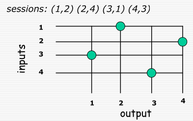
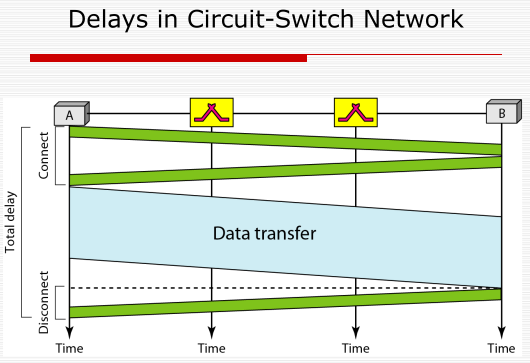
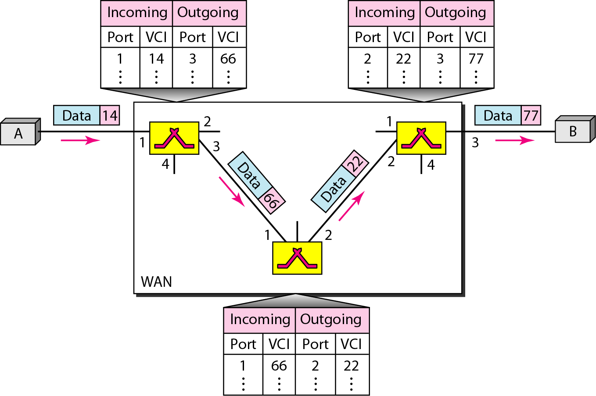
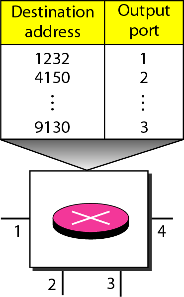

# Switching

## Types of Networks

- **Unswitched**:
  - Point-to-point: A single connection between two devices
  - Broadcast: Data is sent to all devices on the network
- **Switched**:
  - Data is sent to a specific device on the network
  - Data passes through one ore more intermediate nodes

## Why Switching?

- **Cost**: Switching is more cost-effective than having each device connected to every other device
- **Geography**: Switching allows for devices to be spread and be vast in number
- **Performance**: Switching allows for better performance than broadcasting

## Routing vs Switching

| **Feature**              | **Switching**                                  | **Routing**                                    |
| ------------------------ | ---------------------------------------------- | ---------------------------------------------- |
| **OSI Layer**            | Layer 2 (Data Link)                            | Layer 3 (Network)                              |
| **Forwarding Basis**     | MAC addresses                                  | IP addresses                                   |
| **Device**               | Switch                                         | Router                                         |
| **Primary Purpose**      | Data transfer within a single network (LAN)    | Data transfer between different networks (WAN) |
| **Table Used**           | MAC address table                              | Routing table                                  |
| **Network Segmentation** | Separates collision domains                    | Separates broadcast domains                    |
| **Protocols**            | Ethernet, VLAN                                 | IP, OSPF, BGP                                  |
| **Processing Speed**     | Generally faster                               | Slightly slower due to path calculation        |
| **Example Use Case**     | Connecting devices in a home or office network | Connecting a home network to the internet      |

## Circuit Switching

- A circuit is used for switching data between two devices.
- A dedicated path is allocated between the two devices.

### Space-Division Switching

- Each call is assigned a dedicated path through the switch depending on the destination.
- The switch matrix is a grid of crosspoints that connect the source and destination lines.
- The switch turns on the corresponding crosspoint to connect the source and destination lines.
- Non-intersecting paths can be enabled simultaneously.

### Time-Division Switching

1. **Assigning Time Slots:** Each input line is assigned a specific time slot.
2. **Multiplexing:** The multiplexer reads the corresponding input line and writing it into a single siganal, one after the other.
3. **Demultiplexing:** The demultiplexer receives the multiplexed signal and, during each time slot, writes the data to the intended output line.

- So in a time slot for a specific input line, a path is established to the intended output line.
- The multiplexer and demultiplexer must be synchronized to the time slots.
- Each input line gets equal time on the output line.
- This process continues cyclically for the entire duration of the transmission.
- If the input line has no data to send, the time slot is wasted.

### Problems with Circuit Switching

- **Efficiency**: The circuit may be idle most of the time if the data is not being sent continuously.
- **Delay**: The circuit must be established before data can be sent.

## Message Switching

- **Message**: The entire data is sent as a message.
- **Store-andforward**: Intermediate hops _stores the entire message in a temp buffer_ until the next hop becomes available.
- **Hop-by-hop**: A hop concerns on sending the message to the next hop on the path _when it becomes available_. End-to-end delivery time cannot be garunteed.
- Long messages can hog resources and cause potential delays for the entire network.
  - Hog buffer space at intermediate hops
  - Hog lnks between hops

## Packet Switching

- **Packet**: 
  - The data is divided into smaller packets.
  - Packets contain a header (e.g. destination address, sequence number, etc.) and data.
  - Each packet is sent individually.
- Network comprises of nodes that are linked.

### Virtual Circuit Packet Switching

- **Virtual Circuit**: A logical path is established between the source and destination.
- Each virtual circuit has a unique _virtual circuit identifier (VCI)_ between each path node pair.
- All packets follow the same path.
- There is a setup delay to establish the virtual circuit.

### Datagram Packet Switching

- **Datagram**: Each packet is routed independently.
- Each node makes a decision on the next hop based on the packet destination ip.
- Datagrams may arrive out of order. The destination node must reorder the packets.

### Label Switching

- **Label**: A short, fixed-length identifier that is attached to each packet.
- The label is used to determine the next hop.
- The label is removed at each hop.
