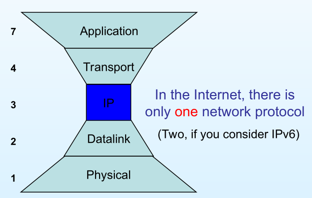
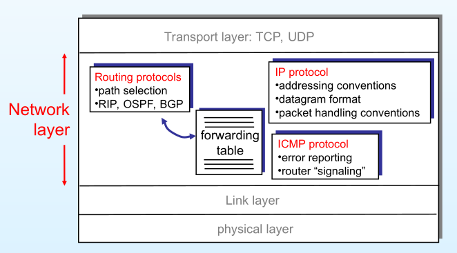
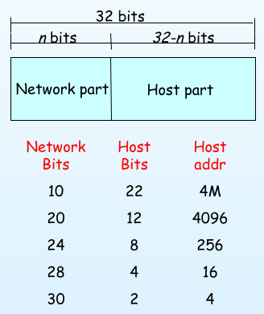
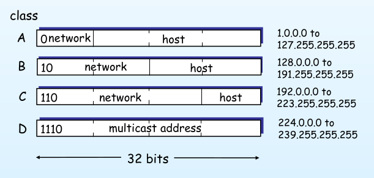
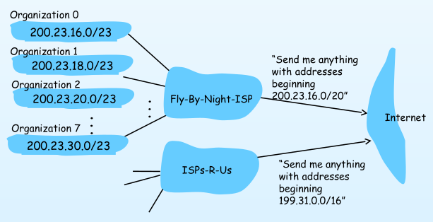
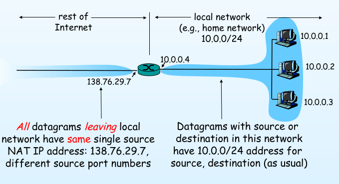

# Internet Protocol

## Introduction

- Internet operates on the TCP/IP protocol suite.

- **TCP**:

  - Transmission Control Protocol
  - Connection-oriented
  - Implemented in the transport layer

- **IP**:
  - Internet Protocol
  - Connectionless
  - Implemented in the network layer

### Features

- open protocol standard: Anyone can implement it
- Independent of the physical network hardware
- Common addressing scheme: IP addresses; uniquely identifies each device on the network

### Standardization

- Adopted as military standard
- Published as RFCs (Requests for Comments). Contained,
  - Practical advice and guidance
  - Protocol implementation specifications

## Internet Network Model

- Internet consists of networks inter-connected by routers.

### The Internet Layers

### The Internet - Network layer

- **Routing protocols**:

  - Used by routers to determine the best path to forward packets
  - Uses forwarding tables to make routing decisions
  - Examples: RIP, OSPF, BGP

- **IP**:

  - Addressing conventions
  - Datagram format
  - Packet handling conventions

- **ICMP**:
  - Internet Control Message Protocol
  - Used for error reporting and diagnostics

## IP Addressing

- 32-bit identifier for hosts and router interfaces
- Generally represented in dotted decimal notation
- **Interface**:
  - A physical link point between a host or router and a network
  - Each interface has an IP address
  - Routers typically have multiple interfaces
  - Hosts typically have one interface

### Parts of an IP Address

- **Netork bits**:
  - Identifies the network
  - Common to all devices on the same network
- **Host bits**:
  - Identifies the host
  - Unique to each device on the same network

> ### IP Addresses Classes (Obsolete)
>
> - Used to define the size of the network and host portions of the address
> - These classes ar obsolete now
>
> 
>
> - Inefficient use of address space, especially for class A and B addresses

### CIDR: Classless InterDomain Routing

- Introduced to overcome the limitations of classful addressing
- Allows for variable length network portions
- Format: **a.b.c.d/x**
  - **a.b.c.d**: IP address
  - **x**: Number of bits in the network portion

### Network Masks

- Used to identify a range of IP addresses
- **Subnet mask**:
  - 32-bit value
  - 1s in the network portion, 0s in the host portion

### Network Address

- The first address in the network range.
- When all host bits are set to 0, it is the network address.
- Used to identify the network.
- Can be assigned to a host.

### Broadcast Address

- The last address in the network range is used for broadcasting to all hosts on the network.
- When all host bits are set to 1, it is the broadcast address.
- When a host sends a broadcast message, it sends it to the broadcast address.
- Unassignable to a host.

### Assigning IP Addresses

- **Static**:
  - Manually assigned
  - Typically used for servers, routers, etc.
- **DHCP**:
  - Dynamic Host Configuration Protocol
  - Dynamically assign IP addresses which are sent by a DHCP server
  - Typically used for client devices
- **ISP Assigned**:
  - Assigned by the ISP when dialing up
- **Self-assigned**:
  - Devices can assign an available IP address to themselves

### Sub-dividing networks

- Network gets its IP block from the ISP
- ISP gets its IP block from the regional internet registry
- Regional registry gets its IP block from the ICANN

> **ISP**: Internet Service Provider
> **RIR**: Regional Internet Registry
> **ICANN**: Internet Corporation for Assigned Names and Numbers

- Hierarchical addressing: route aggregation
  - Routes multiple networks as a single route
  - Minimizes the number of routes in routing tables

### Address Resolution Protocol (ARP)

- Used to get the MAC address of a device on the same network by using its IP address
- Steps:
  1. Device knows the IP address of the device it wants to communicate with
  2. Device knows its own IP address and MAC address
  3. Device needs the MAC address of the device with the specified IP address
  4. Device broadcasts an ARP request to all devices on the network asking for the MAC address of the device with the specified IP address
  5. The device with the specified IP address responds with its MAC address
  6. The device can now communicate with the other device

### Private IP Blocks

- IANA has reserved some IP blocks for private networks
- These addresses are not routable on the internet, unique to each private network
- Addresses outside these blocks are **public addresses**

| Class | Start Address | End Address     |
| ----- | ------------- | --------------- |
| A     | 10.0.0.0      | 10.255.255.255  |
| B     | 172.16.0.0    | 17.16.255.255   |
| C     | 192.268.0.0   | 192.168.255.255 |

### NAT: Network Address Translation

- A technique used to allow multiple devices on a private network to share a single public IP address
- Local devices are assigned private IP addresses inside the local network
- The router translates the private IP addresses to the **public IP address and port** when sending packets to the internet
- Outoging datagrams are modified to include the public IP address as the source.
- Incoming datagrams are modified to include the private IP address as the destination.
- Devices on the local network may be unaware of the NAT translation.
- NAT can be used to hide the internal network structure from the internet.
  - Connecting a device to the local network is easy as it only needs to be assigned a private IP address.
  - Switching to a different ISP is easy as public IP change is handled by the router.

## IP Datagram

- **Datagram**:
  - A self-contained, independent entity of data carrying sufficient information to be routed from the source to the destination computer without relying on earlier exchanges between the source and destination computers.
  - The basic unit of data transfer in the IP protocol.
  - Only changes when NAT happens. (So not changed inside a local network)

### Datagram Format

- **Header**:
  - Contains control information
  - Fixed length of 20 bytes
  - Variable length options can be added
- **Data**:

  - Contains the actual data being transmitted
  - Maximum size of 65,535 bytes

- Abstract format
  - 

### Transmission process

1. Source device creates a datagram
2. Source device looks up the destination IP address in its forwarding table
   - If the destination is on the same network, the destination MAC address is found using ARP, and the datagram is sent
   - If the destination is on a different network, the router (gateway ip) MAC address is found using ARP, and the datagram is sent to the gateway
