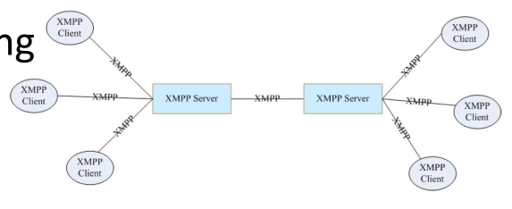

# Electronic Communication

## Email

- Used to send messages over the network.
- Sender/receiver may be a person or a program.
- Messages can be sent to,
  - A single recipient
  - Multiple recipients
  - A mailing list
- Messages are sent to an email address.
- Each address corresponds to a mailbox (or a mailing list) on a mail server.
- Mail is delivered to the recipient's mailbox on the mail server.
  - Recipient can retrieve the mail at their convenience.
  - Recipient may be informed of new mail by the mail server.
- Recieved mail may be stored for later use.

### Reasons for popularity

- **Widely used**: Almost everyone has an email address.
- **Easy to use**: User-friendly features. Convenience of reading at your convenience.
- **Cost-effective**: No need for paper, envelopes, stamps, etc.
- **Reliable**: Messages are stored on the mail server until the recipient retrieves them.
- **Fast**: Messages are delivered in seconds.
- **Convenient**: Can send messages to multiple recipients at once.
- **Backward compatibility**: Easily interfaces with paper-based systems.

### Email vs Web

| Web                     | Email                               |
| ----------------------- | ----------------------------------- |
| Real-time               | Asynchronous (Send now, read later) |
| Unidirectional (Mostly) | Bidirectional                       |

## Instant Messaging (IM)

- Used for Real-time text communication between users.
- **Examples**: WhatsApp, Messenger, Slack, Microsoft Teams.
- Usually the messages are short.
- Message delivery is extremely fast.
- **Advantages**:
  - **Real-time communication**: Instant response.
  - **Presence awareness**: Users can see contact availability (online/offline status).
  - **Media versatility**: Supports multimedia sharing (images, documents, videos).

## Web Forums

- Used for asynchronous discussion on specific topics/groups in a structured format.
- **Examples**: Reddit, Stack Overflow, Quora.
- Convienient to read, reply and archive messages.
- Login to website (or app) to access.
- May also provide email interface (E.g. email notifications).

# E-Mail Systems

## Access methods

- **Text-based clients**:
  - Not common anymore.
- **Graphical mail clients**:
  - E.g. Outlook, Thunderbird.
  - Client runs on the user's computer.
- **Web-based clients**:
  - E.g. Gmail, Yahoo Mail.
  - Client runs on the server, accessed via a web browser.
  - Can be accessed from any device with an internet connection.

## Structure

### Mail Client (Mail User Agent)

- Also known as **mail reader**.
- Functions:
  - **Compose**: Create new messages.
  - **Read**: View received messages.
  - **Reply**: Respond to messages.

| Function | Mail type | Role   | Other party   | Example protocols |
| -------- | --------- | ------ | ------------- | ----------------- |
| Send     | Outgoing  | Client | Mail Server   | SMTP              |
| Receive  | Incoming  | Client | Message Store | POP3, IMAP        |

### Mail Server (Mail Transfer Agent)

- **Called _mail gateway_ in the context of a mail server that performs additional functions.**
- Functions:
  - **Receive**: Accept messages from other mail servers.
  - **Store**: Store messages for the message store to access.
  - **Send**: Forward messages from mail clients to other mail servers.
- Additional functions:
  - May store messages temporarily if recipient's mail server is unavailable.
  - May filter messages for spam, viruses, etc.
  - May handle mailing lists.

| Function | Mail type | Role   | Other party        | Example protocols |
| -------- | --------- | ------ | ------------------ | ----------------- |
| Receive  | Outgoing  | Server | Mail Client        | SMTP              |
| Receive  | Incoming  | Server | Other Mail Servers | SMTP              |
| Forward  | Outgoing  | Client | Other Mail Servers | SMTP              |

<details>
<summary><i>Mail Gateway IRL</i></summary>

### Mail Gateway

- Functions:
  - **Translate**: Convert messages between different mail systems.
  - **Filter**: Filter messages for spam, viruses, etc.
  - **Route**: Route messages to the correct mail server. This includes handling mailing lists.
- If a mail gateway is setup, the mail server do not need to perform these functions. Instead, the mail server forwards messages to the mail gateway.
</details>

### Message Store

- Functions:
  - **Store**: Store messages for the recipient to access (Inbox).
  - **Deliver**: Deliver messages to the recipient's mail client.
- May contain multiple mail folders (Inbox, Sent, Drafts, Trash, etc.).
- Usually associated with a mail server. Sometimes, the mail server itself may act as the message store.

| Function | Mail type | Role   | Other party | Example protocols |
| -------- | --------- | ------ | ----------- | ----------------- |
| Deliver  | Incoming  | Server | Mail Client | POP3, IMAP        |

### Firewall

- Protects the mail server from unauthorized access.

## Email Activities

### Sending an Email

1. MUA is configured with the user's email address and the address of the user's MTA.
2. MUA uses the submission protocol to send the email to the MTA.
   - Submission protocol: Usually SMTP.
   - MTA may authenticate the user.
   - MTA may use TLS to encrypt the connection.
   - MTA may limit where clients can connect from.
   - MTA may scan the mail because,
     - To prevent data leaks and malware.
     - To preserve the reputation of the sending party.
3. MTA looks up the recipient's domain in the DNS to find the recipient's MTA.
   - An MX (Mail Exchange) record in the DNS specifies the recipient's MTA.
   - There may be multiple MX records for redundancy. Priority is indicated by the preference number.
4. MTA sends the email to the recipient's MTA.
5. Recipient's MTA may do some checks (e.g. spam filtering) or forward the email to a scanner.
6. Recipient's MTA stores the email in the recipient's mailbox on the message store.

### Receiving an Email

1. Recipient's MUA checks the recipient's mailbox on the message store.
2. Recipient's MUA downloads the email using the retrieval protocol (POP3 or IMAP).

### Mailing Lists

- A mailing list is an email address that specifies a special mailbox called the **list manager**.
- The list manager is a program that manages the mailing list (i.e. it sends the email to all the recipients in a list).
- The sender does not need to know the email addresses of individual recipients.

## Protocols and Standards

### SMTP (Simple Mail Transfer Protocol)

- Simple text-based protocol.
- Uses client-server architecture.
  - The email comes from the client.
  - The email is recieved by the server.
- Uses command-response interactions.
  - Commands are sent by the client.
  - Responses are sent by the server.
- A command is 4 characters followed by arguments.
- A response is a 3-digit code followed by a message.


### IMAP (Interactive Mail Access Protocol)

- Used to access/retrieve email on a message store.
- More complex, but more powerful than POP3.
- Allows retrieving messages or parts of messages (e.g. headers, attachments).
- Allows the user to organize email in folders on the message store.
  - But slower to use because of the additional commands.
- Suitable for,
  - LAN and dial-up connections.
  - Users who access their email from multiple devices.
  - Mobile users.

### MIME (Multipurpose Internet Mail Extensions)

- Extends the capabilities of email. (SMTP was originally designed for text only).
- Allows sending files of arbitrary types.
- The mime information is included in the email. (In the [headers](#headers)).
- **MIME types** are used to identify the type of content. They are in the format `type/subtype`.
  - text: plain, html
  - image: jpeg, gif
  - audio: basic, mp3, wav
  - video: mpeg, quicktime
  - application: msword, octet-stream (binary data, must be processed by an application)

## Email Security

### Secure Email

- **Encryption**: Encrypt the email content.
- **Signing**: Sign the email to verify the sender.
- These techniques are end-to-end,
  - The email is encrypted and signed by the sender and decrypted and verified by the recipient.
  - Mail servers do not get involved. Because of this, the email is secure even if the mail servers are compromised.
- Uses PGPs (Pretty Good Privacy) or S/MIME (Secure/Multipurpose Internet Mail Extensions).
- Needs public key infrastructure (PKI) to work.
  - PKI is used to manage public and private keys.
  - Crtification authorities (CAs) issue digital certificates.

### Authentication

- Anyone can send an email claiming to be from a mail server.
- This type of forgery is called **email spoofing**.
- Authentication techniques are used to verify the sender's identity.
  - **Sender Policy Framework (SPF)**
  - **DomainKeys Identified Mail (DKIM)**

#### Sender Policy Framework (SPF)

- Specifies which mail servers are allowed to send email on behalf of a domain.
- SPF records are published in the DNS as reverse MX records.

## Email Format

- Defined by RFC 822 (and later).

### Envelope

- **Contains delivery information**.
- Added and used by the mail servers.
- Includes,
  - Recipient addresses.
  - Sender address (for error messages).
  - Priority.
  - Sometimes security information.

### Headers

- **Contains control information**.
- Added and used by the mail clients.

#### From

- The name and email address of the sender.
- May be different from the envelope sender.

#### To

- The name and email address of the primary recipient(s).
- May be multiple recipients.
- May be different from the envelope recipient.

#### CC

- **Carbon Copy**. The name and email address of the secondary recipient(s).

#### BCC

- **Blind Carbon Copy**. The name and email address of the hidden recipient(s).

|                     | Other "To" Recipients | Other "CC" Recipients | Other "BCC" Recipients |
| ------------------- | --------------------- | --------------------- | ---------------------- |
| **"To" Recipient**  | Can See               | Can See               | Can't See              |
| **"CC" Recipient**  | Can See               | Can See               | Can't See              |
| **"BCC" Recipient** | Can't See             | Can't See             | Can't See              |

#### Subject

- A brief description of the email content.

#### Date

- The date and time the email was sent.

#### Message-ID

- A unique identifier for the email.

#### Recieved

- A record of the email's journey from the sender to the recipient.
- Each **mail server adds a "Received" header**.
- Useful for debugging and identifying forged emails.

#### Multimedia Extensions

- MIME headers are used to describe the content of the email.
- **MIME-Version**: The version of the MIME standard used.
- **Content-Type**: The type of content.
- **Content-Transfer-Encoding**: The encoding used for the content.
- **Content-ID**: A unique identifier for the content.
- **Content-Description**: A description of the content.

> `Content-Type: Multipart/Mixed; boundary=StartOfNextPart` indicates that the email contains multiple parts, some of which are attachments.
> Parts are separated by the **boundary string**.
> Then, each part has its own `Content-Type`,`Content-Transfer-Encoding`, etc.
>
> ```http
> From: Amara@roti.lkFrom: Amara@roti.lk
> To: Pala@hoppers.edu
> Subject: Picture of yummy roti.
> MIME-Version: 1.0
> Content-Type: multipart/mixed; boundary=StartOfNextPart
>
> --StartOfNextPart
> Dear Pala, Please find a picture of a roti.
> --StartOfNextPart
> Content-Transfer-Encoding: base64
> Content-Type: image/jpeg
> <base64 encoded data .....
> .........................
> ......base64 encoded data>
> --StartOfNextPart
> Do you want the recipe?
> ```

# Messaging

- **Messaging systems** are used to send messages between people, devices or programs.
- Common messaging types/services:
  - SMS (Short Message Service)
  - WhatsApp, Viber, Skype
  - Facebook Messenger, Google messages
  - Slack, Microsoft Teams (for businesses)

## Proprietary Messaging Systems

- Unlike email, most messaging systems are **proprietary**.
- Both sender and receiver must use the same messaging system.
- **Advantages**:
  - **Ease of use**: No need to know the recipient's exact details.
  - **Rich features**: E.g. multimedia sharing, voice/video calls.
  - **Presence awareness**: Users can see contact availability.
  - **Reliability**: Messages are stored on the messaging server until the recipient retrieves them.
  - **Fast**: Messages are delivered in seconds.
- But may introduce **vendor lock-in** (users are tied to a specific vendor/system).

## eXtensible Messaging and Presence Protocol (XMPP)

- An open standard for messaging and presence.
- **Decentralized**: Anyone can run an XMPP server. Servers can communicate with each other.
- XML-based messages.
- Supports presence awareness, attachments, groups, etc.
- WhatsApp used to use XMPP, but now uses a proprietary protocol that is based on XMPP which is suitable for their needs.
- Popular for IoT (Internet of Things) messaging.


