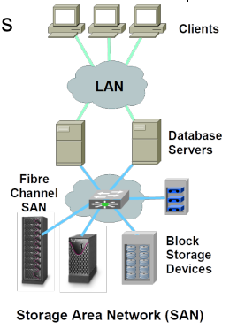
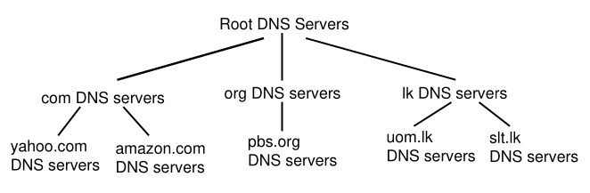
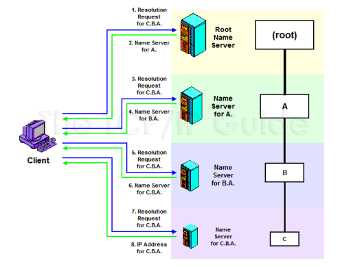

# File Storage (A Network Application)

- File storages that are not in the accessing device.
- Files are accesed using a client
  - **Intergrated**: The OS (or core software, like explorer) acts as the client
  - **Dedicated**: A separate software is used to access the files
  - **Web-based**: A web browser is used to access the files

## File Transfer Protocol (FTP)

- A protocol used to transfer files between a client and a server
- Uses TCP
- Uses two connections:
  - **Control Connection**: Used to send commands and responses (Usually on port 21)
  - **Data Connection**: Used to transfer files (Usually on port 20)
- Authentication is done using a username and password
- Example commands:
  - `USER <username>`: User identification
  - `PASS <password>`: Password for access
  - `CWD <directory>`: Change working directory
  - `LIST`: List files in the current directory
  - `RETR <filename>`: Retrieve a file
  - `STOR <filename>`: Store a file
  - `QUIT`: End the connection

## Secure File Transfer Protocol (SFTP)

- A protocol used to transfer files using TLS protocol (Transport Layer Security) between a client and a server
- Similar to FTP, but uses SSH protocol (Secure Shell) for authentication and encryption
  - So not only password-username, but other authentication methods can be used
- Nowadays, SFTP is more popular than FTP

## Network File System (NFS)

- Also known as **Network Attached Storage (NAS)**
- Usually integrated with the OS
- **File system**: A set of files and directories
- Server **shares** one or more file systems.
- Clients can **mount** the shared file systems.
- Users cannot distinguish between locally mounted file systems and network mounted file systems
- File operations are sent to the server, and the server performs the operations
- Examples:
  - **Windows**: SMB
  - **Unix (Sun)**: NFS

## Storage Area Network (SAN)

- Accessed at **block level**, not file level
- **High performance**
- **Shared storage** among servers (not typically clients)
- Includes **management tools** for storage

## Internet Storage

- Accessing files over the internet
- Used for storage space, backup, file sharing, etc.
- Main issue: internet is **slow** and **less reliable** than LAN
- Usually web-based or dedicated software is used
- Protocols:
  - WebDAV
  - SMB
- Examples:
  - **Google Drive**
  - **Dropbox**
  - **OneDrive**
  - **iCloud**

# Domain Name Service (DNS)

## Introduction

- Hosts are identified by IP addresses
- IP addresses are not human-friendly
- Thus, alphanumeric hostnames (**domain names**) are used
- These domain names need to be mapped to IP addresses
- Initially, a **hosts file** (/etc/hosts) was used for this mapping. This was not scalable.
- **DNS** was developed to solve this problem
- **DNS** is a distributed database system that maps domain names to IP addresses
- It is a **hierarchical** system

## Functions of DNS

- **Name to IP address**: Resolving domain names to IP addresses
- **IP address to name**: Resolving IP addresses to domain names
- **Name to other information**: Resolving domain names to other information (like mail server, etc.)

## Servers and Clients

- **Name servers**:
  - Servers that store DNS records.
  - Respond to resolution requests from clients.

- **Resolvers**:
  - Clients that request resolution from name servers.
  - Types of resolution requests:
    - Standard name resolution: Resolving domain names to IP addresses
    - Reverse name resolution: Resolving IP addresses to domain names
    - Electronic mail resolution: Resolving domain names to mail server information

  ### Name Servers

  - **Authoritative Name Servers**:
    - Servers that store DNS records for a domain.
    - They are the ultimate source of information for a domain.
    - They are responsible for responding to queries about the domain.
    - They are usually managed by the domain owner.

  - **Local Name Server**:
    - A name server that is used by a client to resolve domain names.
    - It is usually provided by the ISP (default name server). Can be configured manually.
    - It caches DNS records to reduce the load on authoritative name servers.

## DNS Name Resolution Process

- This process is iterative. The resolver queries multiple name servers to resolve a domain name.

